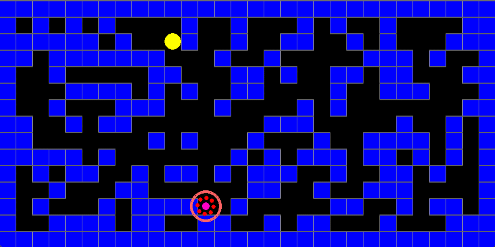

# PacManAI

The following script is an implementation of a basic game in Pac-Man style. It demonstrates the use of classical AI as
the controller of the agent _(Pac-Man)_ of the game. It tries to find the shortest path to the food (the goal) while
only knowing its own sequence of actions and positions; meaning it __can't "see" the surroundings__ unless it tries
to move to them.

There are both a **GUI** and a **TUI** embedded into the script (which can be switched using the global variable **`gui`**). **Step-by-step decision logs** of the agent can be observed in the terminal by changing the global variable **`log`** to **`True`**).

